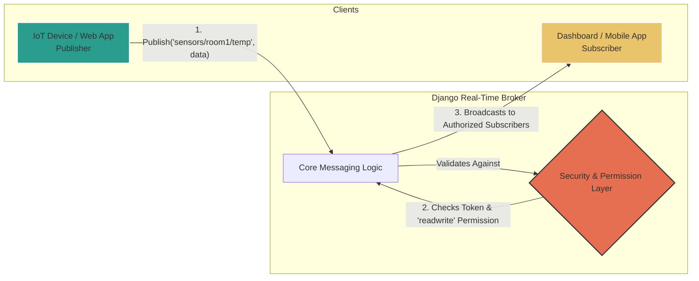

### `docs/1-introduction.md`

# 1. Introduction

Welcome to the official documentation for the Django Real-Time Broker. This project provides a high-performance, secure, and dynamic messaging system for real-time applications.

## At a Glance: How It Works

At its core, the project acts as a central, secure broker that manages the flow of information between publishers and subscribers. It authenticates every client and checks their permissions for every topic, ensuring that data only goes where it's supposed to.

## Project Purpose

The Django Real-Time Broker is designed to manage WebSocket clients (such as IoT devices, web dashboards, or mobile apps) through a robust, topic-based permission system inspired by MQTT.

The core principle of the system is **security through immediate enforcement**. Any change in the permission backend—such as revoking a token or modifying a topic's access rights—results in the immediate disconnection of all affected clients, ensuring the system's state is always secure and consistent.

## Who is this for?

This project is ideal for developers building applications that require:
-   Real-time, bidirectional communication.
-   A secure way to broadcast data to specific groups of users or devices.
-   Granular control over who can publish and subscribe to data streams.
-   A scalable solution that can handle a large number of concurrent connections.

Examples include IoT platforms, live monitoring dashboards, chat applications, and real-time notification systems.

## Key Features

-   **Token-Based Authentication:** Secure, token-based access for all WebSocket clients.
-   **Dynamic Permissions:** Granular `read` and `readwrite` permissions for topics.
-   **MQTT-Style Topics:** Flexible topic matching using `+` and `#` wildcards.
-   **Real-Time Security:** Instantly disconnects clients whose permissions are revoked.
-   **Connection Limiting:** Prevents resource abuse with atomic, per-token connection limits.
-   **Scalable:** Built on an ASGI foundation ready for horizontal scaling.
