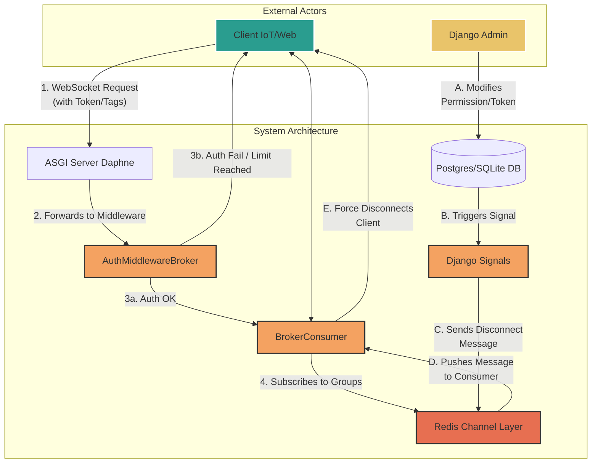

# 4. Architecture

The system is built on a modern, asynchronous (ASGI) stack designed to handle a large number of concurrent, long-lived WebSocket connections efficiently. The architecture prioritizes a clear separation of concerns, with distinct layers for authentication, connection management, and real-time event handling.

## High-Level System Diagram

This diagram illustrates the two primary workflows of the system: the initial **Connection Flow** (numbered steps) and the **Real-Time Security Enforcement Flow** (lettered steps).

---

## Component Breakdown

Each component in the architecture has a specific and crucial role.

### 1. ASGI Server (e.g., Daphne)

The front-line server that accepts WebSocket connections. It acts as the entry point, handling the low-level details of the ASGI protocol and passing the connection scope to the Django Channels application.

### 2. AuthMiddlewareBroker (The Gatekeeper)

This custom middleware is the system's primary security layer. It runs **before** any consumer code is executed for a new connection. Its responsibilities are:
1.  **Extracting Credentials:** It parses the `Authorization` and `Tag` headers from the initial connection request.
2.  **Validating the Token:** It performs an asynchronous database query to verify the token's existence.
3.  **Checking Permissions:** It meticulously checks every requested tag against the token's permissions, fully supporting wildcard matching.
4.  **Enforcing Connection Limits:** It atomically checks and enforces the `max_connections` limit using Redis's `incr` command to prevent race conditions under heavy load.

If any of these checks fail, the middleware rejects the connection immediately. Otherwise, it populates the connection `scope` with the client's permissions and passes it to the consumer.

### 3. BrokerConsumer (The Connection Manager)

The consumer is the core logic for handling an **active** WebSocket connection. It manages the entire connection lifecycle:
-   **`connect()`:** When a connection is accepted by the middleware, this method adds the client's channel to the appropriate groups in the Redis Channel Layer based on its subscribed tags.
-   **`receive()`:** It processes incoming JSON messages from the client. When a client attempts to publish a message, this method checks its `readwrite` permission for the target tag before broadcasting it.
-   **`disconnect()`:** When a client disconnects, this method cleans up by removing the channel from all associated groups and decrementing the connection counter in Redis.
-   **Event Handlers (`permission_update`, `token_update`):** It actively listens for internal control messages from the channel layer. If a message indicates that the client's permissions have been revoked, the handler will immediately force-close the connection.

### 4. Redis Channel Layer (The Nervous System)

Redis serves as the high-speed messaging backbone that enables the system to be both real-time and scalable. It has two distinct roles:
1.  **Message Broadcasting:** It provides the Pub/Sub mechanism for broadcasting real-time data messages. When a consumer sends a message to a group (e.g., `sensors/room1/temp`), the channel layer delivers it to all consumers in that group.
2.  **Control Signaling:** It delivers internal system events. When a Django Signal is triggered by a database change, it sends a control message (e.g., "disconnect clients with this token") over the channel layer to the relevant, active consumers. This decouples the web process from the consumer processes.

### 5. Django Signals (The Triggers)

Signals are the "triggers" for the real-time security system. They are the bridge between the database (the source of truth for permissions) and the live WebSocket connections. By listening to `post_save` and `post_delete` events on the `BrokerToken`, `BrokerTag`, and `BrokerPermission` models, the system can react instantly to any changes made in the Django admin or programmatically.
