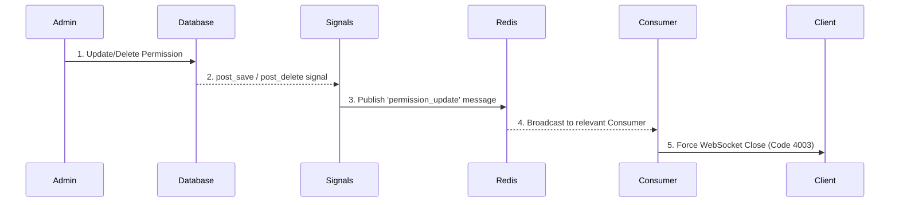

# 6. Security

Security is a foundational principle of the Django Real-Time Broker, enforced at multiple layers of the architecture. The system is designed to be secure by default and to react instantly to changes in the security policy.

## 1. Authentication Layer

Authentication is the first line of defense. It is handled by the `AuthMiddlewareBroker` before any other application logic is executed.

-   **Token-Based Access:** Every new WebSocket connection attempt is intercepted. The system requires a valid token to be passed in the `Authorization` header.
-   **Immediate Rejection:** If the token is missing, malformed, or does not exist in the database, the middleware immediately rejects the connection with a `4001` or `4003` status code. The connection never reaches the core application logic.

---

## 2. Authorization Layer

Once a client is authenticated, the system must determine what it is authorized to do.

-   **Explicit Permissions:** The client must declare all intended subscriptions upfront in the `Tag` header. There is no way for a connected client to subscribe to new topics mid-session.
-   **Granular Topic Validation:** The middleware meticulously checks every requested tag (including those matching wildcards) against the token's assigned `BrokerPermission` records. If even one requested tag is not permitted, the entire connection is rejected.
-   **Read/Write Control:** The `permission` field (`read` vs. `readwrite`) ensures that only authorized clients can publish messages. This check is performed by the `BrokerConsumer` every single time a message is received from a client.

---

## 3. Real-Time Security Enforcement (The Live Shield)

This is the most powerful security feature of the system. The broker does not wait for a client to reconnect to apply new rules; it enforces them in real-time.

This diagram illustrates the rapid enforcement flow:

-   **Instantaneous Reaction:** By using Django Signals, any change to the security models (`BrokerToken`, `BrokerTag`, `BrokerPermission`) is captured the moment it happens.
-   **Decoupled Signaling:** The signal handler uses the Redis Channel Layer to broadcast a control message to the active `BrokerConsumer` instances. This architecture ensures that the system works correctly even when scaled across multiple servers/processes.
-   **Forced Disconnection:** The consumer, upon receiving a control message relevant to the client it's managing, immediately terminates the WebSocket connection with a specific error code.

This guarantees that permission changes are enforced almost instantaneously, leaving no vulnerability window where a client could operate with outdated or revoked privileges.

---

## 4. Resource Protection

-   **Connection Limiting:** The `max_connections` setting on each token protects the server from resource exhaustion, preventing a single token from overwhelming the system.
-   **Race Condition Safety:** This limit is enforced using Redis's atomic `incr` command. This "increment-then-check" method is race-condition-safe, guaranteeing that the connection limit is strictly enforced even under high-concurrency connection attempts from the same token.
