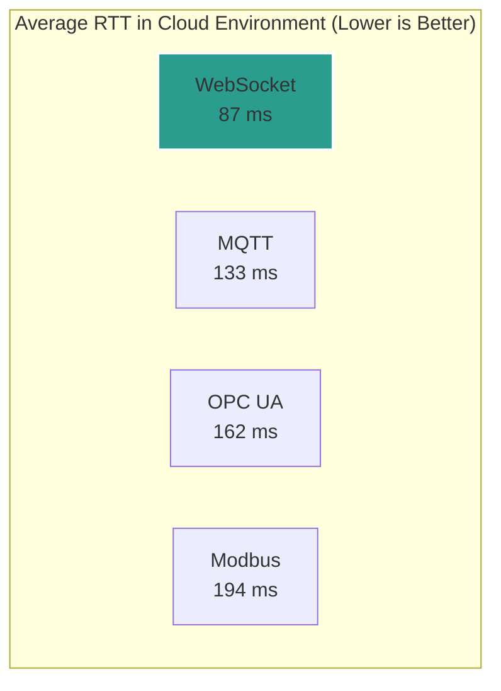

# 7. Performance & Scientific Validation

The architectural choices for any real-time system are critical engineering decisions. The selection of WebSocket as the core protocol for this project was a deliberate choice, grounded in empirical evidence that demonstrates its superior performance in the specific use cases we target.

This page provides a comprehensive overview of the scientific foundation for our architecture, presenting comparative data against leading industrial protocols to validate our approach.

## The Scientific Foundation

Our analysis is benchmarked against a recent, peer-reviewed scientific study that conducted a thorough comparison between WebSocket, MQTT, Modbus, and OPC UA. This study provides an objective performance baseline in realistic operational environments.

**Reference Paper:**
> Hlayel, M., Mahdin, H., & Adam, H. A. M. (2025). *Latency Analysis of WebSocket and Industrial Protocols in Real-Time Digital Twin Integration*. International Journal of Engineering Trends and Technology, 73(1), 120-135.

---

## Comprehensive Performance Benchmark

Based on the study's published results, this table summarizes the performance of all four protocols across the most critical metrics. All data is sourced directly from the reference paper.

| Metric | WebSocket | MQTT | OPC UA | Modbus |
| :--- | :--- | :--- | :--- | :--- |
| **Avg. RTT (Local)** | **43.8 ms** | 94.1 ms | 93.1 ms | 70.8 ms |
| **Avg. RTT (Cloud)** | **87.0 ms** | 133.0 ms | 162.0 ms | 194.0 ms |
| **Server CPU Usage** | **0.09%** | 0.18% | 0.27% | 0.35% |
| **Server Memory (MB)** | **1.05 MB** | 1.09 MB | 1.16 MB | 1.13 MB |
| **Total Bandwidth** | **34 KB** | 228 KB | 215 KB | 118 KB |
| **Avg. Throughput** | 1,159 B/s | **7,782 B/s** | 7,333 B/s | 4,023 B/s |
| **Primary Role** | **Real-Time Control** | Reliable IoT Data | Enterprise Integration | Legacy Systems |

---

## Key Metrics Analysis

### 1. Latency (Round-Trip Time): The Decisive Factor

**Why it Matters:** In real-time control and monitoring, latency is the paramount metric. It dictates how quickly the system can react to changes.

**The Findings:** WebSocket is the undisputed leader in low-latency communication, especially in remote cloud environments, which is the focus of this project.

*   **In the cloud, WebSocket was:**
    *   **35% faster** than MQTT.
    *   **46% faster** than OPC UA.
    *   A staggering **55% faster** than Modbus.

The study also noted that the latency increase for WebSocket in the cloud was almost entirely attributable to network distance, meaning the protocol itself adds minimal overhead. In contrast, the other protocols suffered from significant additional overhead when moving from a local to a cloud setup.

#### **Visualization: Cloud Latency Comparison (ms)**

**(Placeholder for your first graphic: A bar chart showing the significant latency difference between the four protocols in the cloud environment.)**

### 2. Resource Efficiency: Lean and Scalable

**Why it Matters:** Lower server-side resource consumption allows for higher scalability (more connected clients per server) and lower operational costs.

**The Findings:** WebSocket proved to be the most lightweight protocol on the server (broker).

*   **CPU:** WebSocket's CPU usage (**0.09%**) was half that of MQTT and nearly four times lower than Modbus.
*   **Memory:** While all protocols had comparable memory footprints on the server, WebSocket was still the most efficient.

This efficiency is crucial for building scalable platforms that can handle thousands of concurrent connections without requiring massive server infrastructure.

### 3. Protocol Specialization: Throughput vs. Latency

**Why it Matters:** The data transfer metrics reveal the core design philosophy of each protocol.

*   **WebSocket:** Exhibits the lowest throughput and bandwidth. This is not a weakness; it's a sign of specialization. It is engineered to transmit **small, frequent control messages** with the absolute minimum overhead and delay. It's a "race car."
*   **MQTT & OPC UA:** Show the highest throughput. They are designed to handle larger and more complex data payloads, making them suitable for data collection and state synchronization where data volume is more critical than instantaneous delivery. They are "cargo trucks."
*   **Modbus:** Sits in the middle, designed for simple, register-based polling, making it efficient for its intended local use case but slow and inefficient over the web.

---

## The Role of Each Protocol (Based on the Evidence)

*   **🥇 WebSocket: The Real-Time Champion.** The clear winner for any application where immediate feedback and control are the primary requirements. Its simplicity, low overhead, and unparalleled speed make it the ideal modern choice for remote control.

*   **🥈 MQTT: The Reliable IoT Workhorse.** Slower, but built for reliable message delivery in potentially unstable networks (thanks to features like QoS, not fully explored in this latency-focused study). Best suited for IoT data collection from thousands of sensors.

*   **🥉 OPC UA: The Enterprise Integrator.** The slowest among the modern protocols, but its strength lies in its rich, standardized data modeling capabilities. It's designed for complex, heterogeneous industrial environments where interoperability and data context are more important than raw speed. The study noted it required significant tuning (`minimumSamplingInterval`) to perform adequately.

*   **🏅 Modbus: The Legacy Standard.** Its poor performance in the cloud is expected; it was designed decades ago for local, serial communication. It remains relevant for integrating with older, existing hardware on-site but is not a viable choice for modern, remote-first applications.

---

## This Project's Contribution: Adding Security to the Champion

The referenced study, for all its detail, explicitly states a critical limitation: **it did not cover any security aspects.**

**This project fills that critical gap.** It takes the scientifically-validated, highest-performing protocol—WebSocket—and builds a robust, dynamic security and management layer on top of it.

Our system provides not just the *fastest* protocol for real-time communication, but a platform that is also:

-   **Secure:** With a token-based authentication and granular permission system.
-   **Dynamic:** Capable of enforcing security policy changes in real-time by instantly disconnecting non-compliant clients.
-   **Manageable:** Through a complete Django-based backend with a full administrative interface.
-   **Flexible:** Unlike MQTT or Modbus, which faced hardware-specific integration challenges in the study, our WebSocket-based solution is hardware-agnostic.

In essence, we took the "race car" engine validated by science and built a secure, armored, and manageable vehicle around it.
