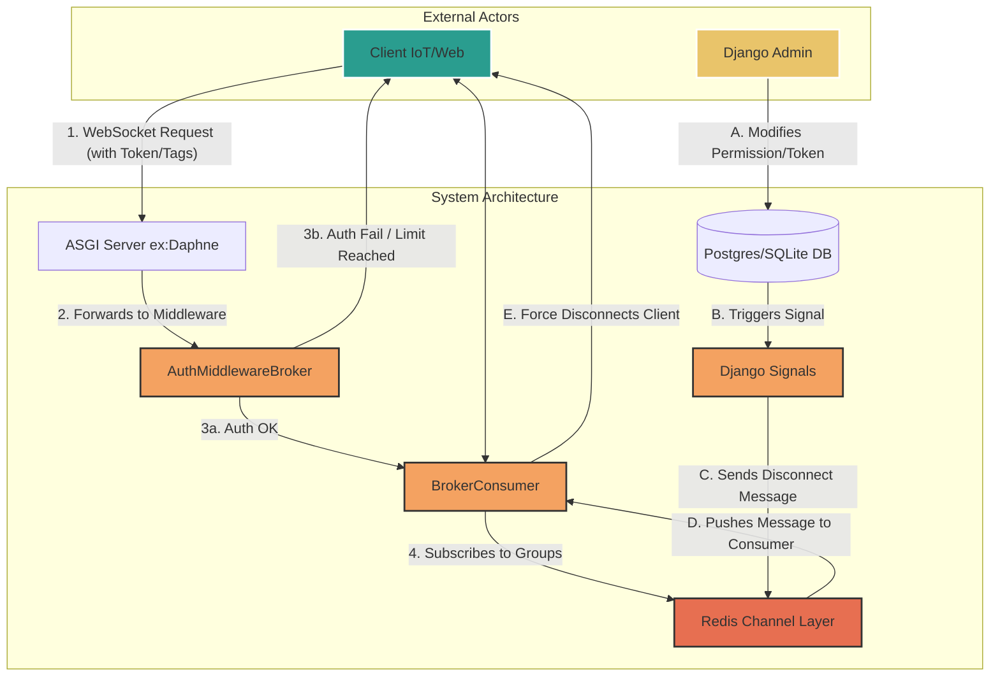

# Django Real-Time Broker

<!-- Badges for style points: e.g., Python version, license -->


A high-performance WebSocket message broker with a dynamic, token-based permission system, built on Django Channels and Redis for real-time security and scalability.

---

## Key Features

-   **Secure Authentication:** Token-based access for all WebSocket clients.
-   **Dynamic Permissions:** Granular `read` and `readwrite` permissions for topics.
-   **MQTT-Style Topics:** Flexible topic matching using `+` and `#` wildcards.
-   **Real-Time Security:** Instantly disconnects clients whose permissions are revoked.
-   **Connection Limiting:** Prevents resource abuse with atomic, per-token connection limits.
-   **Scalable:** Built on an ASGI foundation ready for horizontal scaling.

---

## Quick Start

1.  **Clone the repository:**
    ```bash
    git clone https://github.com/taha2samy/websocket-agent-cluster.git .
    ```

2.  **Install dependencies:**
    ```bash
    pip install -r requirements.txt
    ```

3.  **Configure your environment:**
    *   Ensure Redis is running.
    *   Set up your `.env` file based on `.env.example`.

4.  **Run migrations and start the server:**
    ```bash
    python manage.py collectstatic
    python manage.py migrate
    python manage.py runserver
    ```

---

## Full Documentation

For detailed information on architecture, core concepts, and client integration, please see the [**Full Documentation**](./docs/1-introduction.md).
