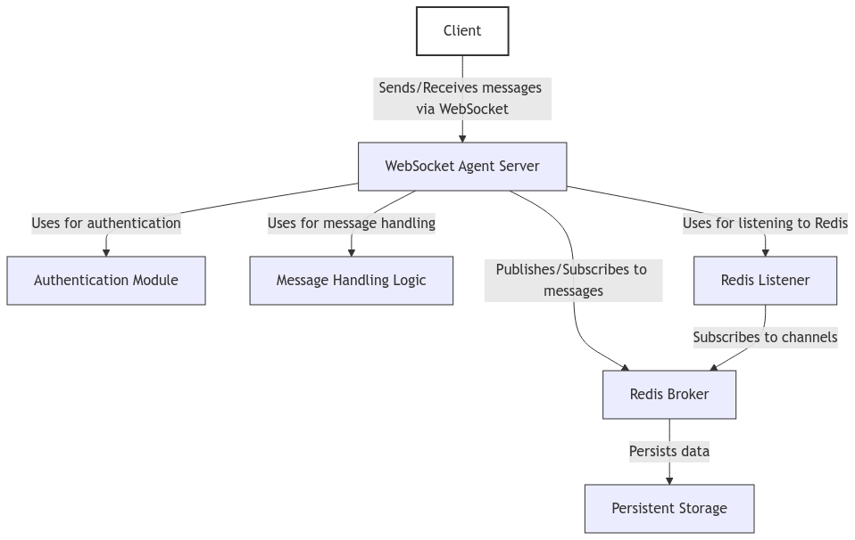
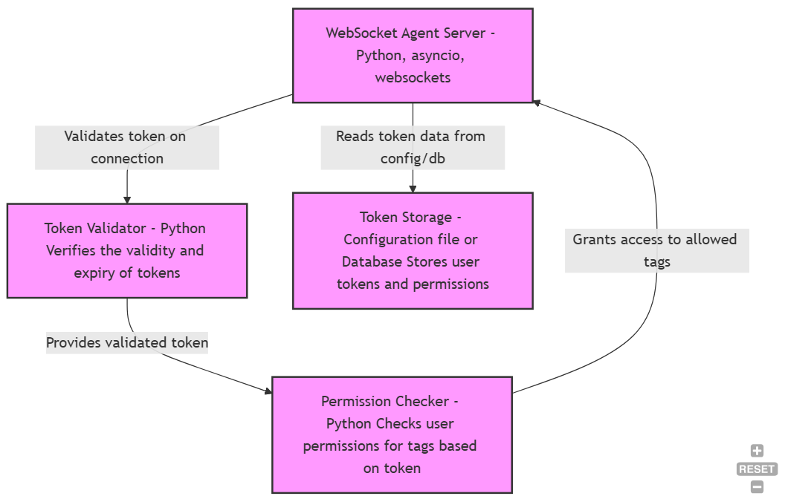
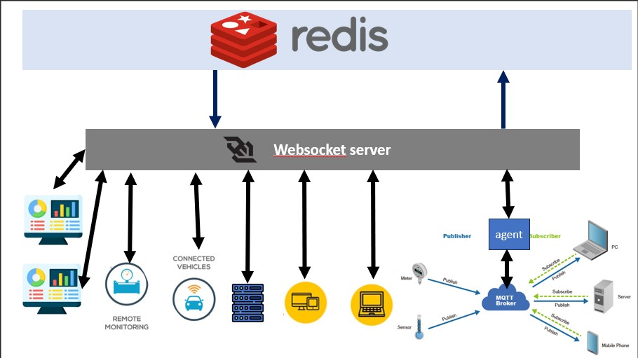

# A WebSocket-based Real-Time Messaging Platform: Design and Performance Evaluation

**Author:** Taha Samy Mohammed  
**Date:** October 17, 2024  

## Abstract
This paper presents a novel WebSocket-based real-time messaging platform designed to overcome the limitations of traditional messaging solutions like MQTT. Our platform leverages the speed and reliability of WebSocket for communication while employing Redis as a message broker for scalable, persistent message delivery. We utilize asynchronous programming with `asyncio` to efficiently handle concurrent connections and messages. The platform features a token-based authentication system for secure access and a tag-based subscription mechanism that enables clients to subscribe to specific channels of interest. The platform is designed for cloud-native deployment, allowing for horizontal scaling and seamless integration with container orchestration tools. We evaluate the platform's performance and scalability through benchmark tests, highlighting its advantages over existing solutions in terms of latency, throughput, and resource utilization.

## Introduction
Real-time messaging systems are essential for modern applications, including chat applications, IoT device management, and real-time data visualization. These applications demand quick and efficient information exchange, often requiring low latency and reliable message delivery. Traditional messaging protocols, such as MQTT, struggle to scale effectively and maintain secure communication in environments with many connected clients and high message volumes.

This paper introduces a WebSocket-based messaging platform designed to address these limitations. By using WebSocket directly instead of MQTT over WebSocket, we achieve native support for real-time, bidirectional communication. While WebSocket handles real-time messaging efficiently, our platform can still incorporate MQTT when needed, particularly in IoT environments.

## Related Work
The choice of communication protocol significantly impacts the performance of real-time messaging systems. Previous studies have demonstrated WebSocket's superior speed and efficiency compared to HTTP and MQTT in various contexts.

WebSocket technology, standardized as RFC 6455, offers a persistent, bi-directional communication channel over a single TCP connection. Its characteristics make it particularly suitable for real-time applications, contributing to its increasing adoption across various industries, including finance, online gaming, and industrial automation.

## System Architecture and Design
The WebSocket agent utilizes a layered architecture to achieve real-time messaging capabilities. This design ensures scalability, flexibility, and high availability.

### Authentication Module
The authentication module enforces secure access through token-based authentication. Clients must provide a valid token to access the platform, with permissions determining their ability to send and receive messages.

### Redis Broker
Redis serves as the message broker, managing message publishing and subscription efficiently. Each tag in the system maps directly to a Redis channel, enabling clients to subscribe to topics of interest.

## Asynchronous Programming with `asyncio`
The WebSocket agent leverages asynchronous programming with the `asyncio` library to handle multiple client connections and process messages concurrently. This approach enhances responsiveness and scalability.

## Performance Evaluation
Benchmark tests simulating various load conditions demonstrated low latency, high throughput, and strong scalability, highlighting the platform's capability to meet real-time communication demands effectively.

## Benefits of Cloud-Native Design
The cloud-native design offers several benefits:
- **Scalability and Elasticity**
- **Resilience and Fault Tolerance**
- **Simplified Deployment and Management**
- **Cost-Effectiveness**
- **Improved Developer Productivity**
- **Enhanced Observability and Monitoring**

These features, combined with WebSocket's real-time capabilities, ensure reliable message delivery at scale.

## Use Cases and Applications
The WebSocket agent is versatile and applicable to various domains:
- **Real-time Chat Applications:** Enables multi-user chat rooms and secure communication.
- **IoT Device Management:** Facilitates communication between IoT devices and a central management system.
- **Real-time Data Visualization:** Supports interactive dashboards and dynamic updates.

## Figures

*Figure 1:* MQTT over WebSocket communication architecture.

*Figure 2:* System Architecture of the WebSocket Agent.

*Figure 3:* Architecture of the Authentication Module.

*Figure 4:* Some usage examples of the WebSocket agent.

## Conclusion
This paper has presented a scalable and secure WebSocket-based real-time messaging platform. By combining the speed and reliability of WebSocket with the scalability and persistence of Redis, our design provides a robust solution for real-time communication.

## References
1. Argeshwara, D. K., Hadi, M. S., Sendari, S., Irvan, M. (2024). Comparative analysis of application layer protocols in EV charging stations: evaluating HTTP, MQTT, and Websocket Performance Metrics. *Bulletin of Social Informatics Theory and Application*, 8(1), 86-96.
2. Friendly et al. (2022). Speed Comparison OF WebSocket and HTTP…
3. Fette, I., Melnikov, A. (2011). The WebSocket Protocol. RFC 6455.
4. Lubbers, P., Greco, F. (2013). HTML5 WebSockets: A Quantum Leap in Scalability for the Web. *International Journal of Web Engineering and Technology*, 8(1), 68-90.
5. Hoffman, D. (2012). Building real-time applications with HTML5 WebSockets. O'Reilly Media.
6. Barnes, R. (2018). Internet of Things Architectures, Protocols, and Platforms. Artech House.
7. Melnikov, A. (2011). WebSocket Proxy Protocol Handshake. IETF Internet Draft.
8. Chika, Y.-B., Esther, O. K. (2019). Financial stock application using WebSocket in Real Time Application. *International Journal of Informatics and Communication Technology (IJ-ICT)*, 139.
9. Armstrong, D. (2015). HTML5 Game Development Hotshot. Packt Publishing Ltd.
10. Mestav, P., Scordino, C. (2018). Industrial Internet of Things: Technologies, Applications and Case Studies. Academic Press.
